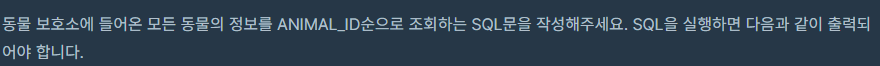
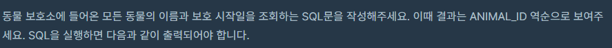
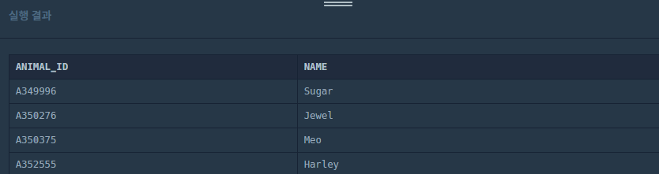

## SELECT

> **SELECT**문은 하나 또는 그 이상의 테이블에서 데이터를 추출하는 SQL의 데이터 조작 언어(DML) 중 하나이다. 이것은 데이터베이스 중 하나 또는 그 이상의 테이블에서 데이터를 추출하기 위한 명령으로 데이터 조작 언어 (DML)에서 가장 많이 사용된다.


#### 1. 모든 레코드 조회하기



``` sql
SELECT * FROM ANIMAL_INS ORDER BY ANIMAL_ID
```


#### 2. 역순 정렬하기



``` sql
SELECT NAME, DATETIME FROM ANIMAL_INS ORDER BY ANIMAL_ID DESC
```


#### 3. 아픈 동물 찾기


``` SQL
SELECT ANIMAL_ID,NAME 
FROM ANIMAL_INS
WHERE INTAKE_CONDITION = 'Sick'
ORDER BY ANIMAL_ID
```


#### 4. 어린 동물 찾기


``` SQL
SELECT ANIMAL_ID,NAME 
FROM ANIMAL_INS
WHERE INTAKE_CONDITION != 'Aged'
ORDER BY ANIMAL_ID
```


#### 5. 동물의 아이디와 이름


``` SQL
SELECT ANIMAL_ID, NAME FROM ANIMAL_INS ORDER BY ANIMAL_ID
```




#### 6. 여러 기준으로 정렬하기


``` SQL
SELECT ANIMAL_ID,NAME,DATETIME FROM ANIMAL_INS
ORDER BY NAME ASC, DATETIME DESC
```


#### 7. 상위 N개 레코드


``` SQL
SELECT NAME
FROM (SELECT NAME FROM ANIMAL_INS ORDER BY DATETIME)
WHERE ROWNUM = 1;
```

