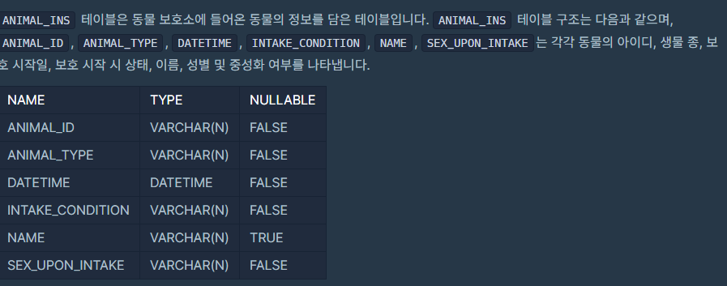

## SQL 집계함수(SUM,MAX,MIN)

> 집계함수(그룹함수)는 말 그대로 이미 기록된 정보를 모아서 계산하는 함수를 말한다.
>
> 이를테면, 총 데이터가 몇 개가 되는지, 수치가 있다면 그 합계는 얼마인지 등을 계산하여 출력해준다.





#### 1. 최댓값 구하기

가장 최근에 들어온 동물은 언제 들어왔는지 조회하시오.

``` SQL
SELECT max(datetime) as 시간
from animal_ins
```


#### 2. 최솟값 구하기

동물 보호소에 가장 먼저 들어온 동물은 언제 들어왔는지 조회하는 SQL 문을 작성해주세요.

``` SQL
SELECT min(DATETIME) AS 시간 
FROM ANIMAL_INS
```


#### 3. 동물 수 구하기

동물 보호소에 동물이 몇 마리 들어왔는지 조회하는 SQL 문을 작성해주세요.

``` SQL
SELECT COUNT(ANIMAL_ID) 
FROM ANIMAL_INS
```


#### 4. 중복 제거하기

동물 보호소에 들어온 동물의 이름은 몇 개인지 조회하는 SQL 문을 작성해주세요. 이때 이름이 NULL인 경우는 집계하지 않으며 중복되는 이름은 하나로 칩니다.

``` SQL
SELECT COUNT(DISTINCT NAME) FROM ANIMAL_INS WHERE NAME IS NOT NULL
```

